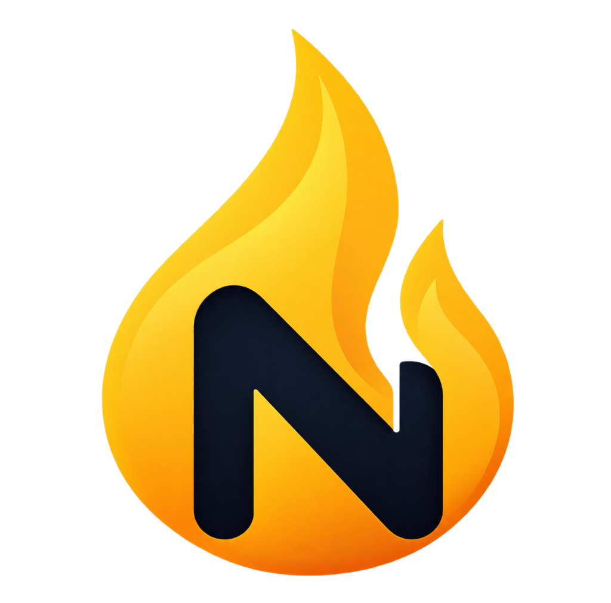
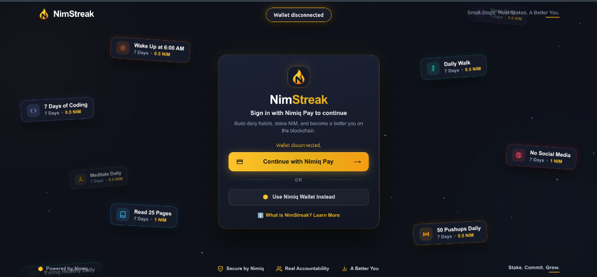
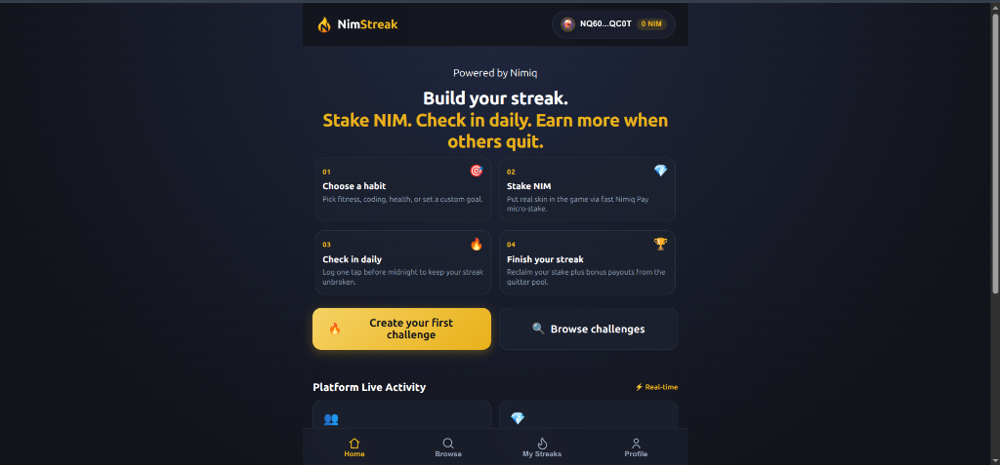
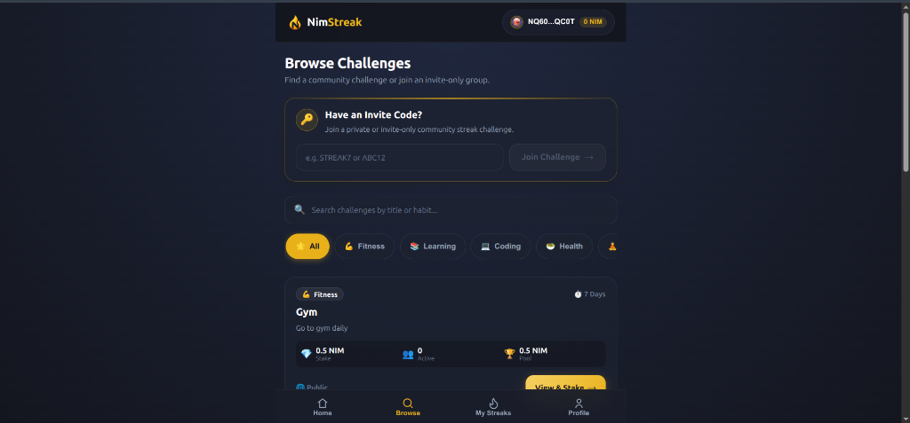
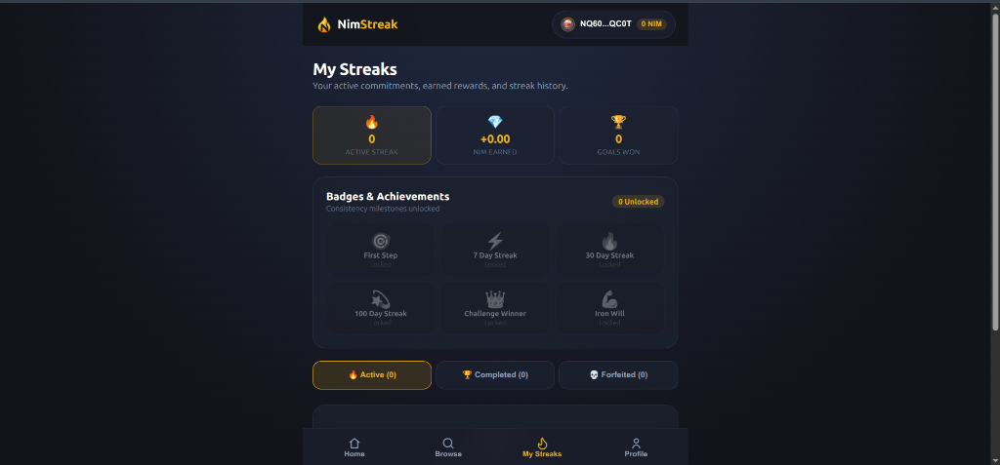
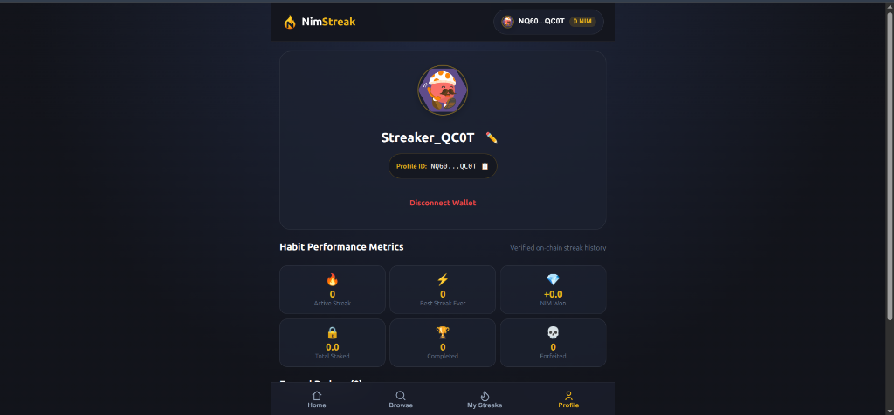

<p align="center">
  <a href="https://nimstreak.vercel.app">
    
  </a>
</p>

<h1 align="center">NimStreak</h1>

<p align="center">
  <strong>Small Steps. Real Stakes. A Better You.</strong><br />
  The high-stakes habit accountability game on the Nimiq blockchain.
</p>

<p align="center">
  <a href="https://nimstreak.vercel.app"></a>
  
  
  
  
</p>

<p align="center">
  <a href="#-about">About</a> •
  <a href="#-the-game-loop">Game Loop</a> •
  <a href="#-why-nimstreak-works">The Psychology</a> •
  <a href="#-how-it-works">How It Works</a> •
  <a href="#-core-application-screens">App Screens</a> •
  <a href="#-reward-model--quitter-pool">Reward Economics</a> •
  <a href="#-game-features">Features</a> •
  <a href="#-architecture">Architecture</a> •
  <a href="#-financial-safety--security">Safety</a> •
  <a href="#-getting-started">Getting Started</a>
</p>

---

## 📖 About

**NimStreak** is a Nimiq-powered habit accountability Mini App that turns personal goals into high-stakes on-chain challenges. By staking real NIM, players put skin in the game to build daily consistency. Check in every day to keep your streak alive, protect your stake, and claim bonus rewards from the **Quitter Pool** funded by participants who quit.

---

## 🎮 The Game Loop

Most habit trackers fail because **quitting is free**. When there are no consequences for skipping day 4 of your workout or coding sprint, your brain easily chooses comfortable defeat.

**NimStreak turns daily consistency into a high-stakes competitive game:**

```
  ┌─────────────────┐       ┌─────────────────┐       ┌─────────────────┐
  │ 1. JOIN QUEST   │ ────► │ 2. STAKE NIM    │ ────► │ 3. CHECK IN     │
  │ Pick habit &    │       │ Deposit crypto  │       │ Tap daily before│
  │ duration (7-30d)│       │ into the pot    │       │ midnight UTC    │
  └─────────────────┘       └─────────────────┘       └────────┬────────┘
                                                               │
                                  ┌────────────────────────────┴───────────────────────────┐
                                  ▼                                                        ▼
                         ❌ Missed Check-in / Quit                          🔥 100% Days Completed
                                  │                                                        │
                                  ▼                                                        ▼
                         💀 STAKE FORFEITED                               🏆 VICTORY PAYOUT
                         Your deposit goes to the                         • 100% original stake back
                         active Quitter Pool                              • Equal share of Quitter Pool
                                  │                                       • Scaled NimStreak bonus
                                  └───────────────────────────────────────────────►┘
```

> **The Hook:** Stay disciplined and you take home the forfeited stakes of everyone who quit. Break your promise, and your coins fund the winners.

---

## 🧠 Why NimStreak Works

- **Loss Aversion:** Behavioral economics proves people work twice as hard to avoid losing $10 as they do to gain $10. Staking real NIM activates loss aversion for positive life change.
- **Social Accountability:** Create private challenges with friends, share invite codes, and compete on the live streak leaderboard.
- **Visible Momentum:** The interactive streak calendar turns daily discipline into tangible, colorful momentum you don't want to break.
- **Zero-Friction Crypto:** Runs natively inside the **Nimiq Pay Mini App** ecosystem with instant checkout, fast Albatross finality, and tiny transaction fees.

---

## ⚡ How It Works

### Step 1: Connect Nimiq Pay
Tap **"Continue with Nimiq Pay"** to link your non-custodial wallet inside the Mini App environment. No seed phrases to enter, no complex network switches.

### Step 2: Choose or Create a Challenge
Browse trending community challenges or spin up your own custom challenge:
- 🏃 **Fitness:** 50 Pushups Daily, 10,000 Steps, Morning Run
- 💻 **Coding:** Ship 1 Commit Daily, Solve 1 LeetCode, Build in Public
- 🥗 **Health:** Drink 2L Water, Zero Sugar, Eat Clean
- 🧘 **Mindfulness:** 15m Meditation, Read 25 Pages, Cold Shower
- ⚙️ **Custom:** Set your own rules, duration (7, 14, 21, or 30 days), and stake (0.5 to 100 NIM).

### Step 3: Stake Your NIM
Confirm your stake transaction through Nimiq Pay. The backend verifies the transaction directly on the Nimiq blockchain via RPC before granting you active participant status.

### Step 4: Check In Daily
Open NimStreak once per day before midnight UTC and hit **"Check In"**. Add optional proof notes or reflections to chronicle your journey. Watch your streak flame climb!

### Step 5: Claim Your Rewards
Survive the challenge to cross the finish line. Claim your prize directly back to your Nimiq address with a single tap.

---

## 📱 Core Application Screens

Explore the visual design and interactive user journey of NimStreak:

---

### 1. 🌟 The Landing Page
> *Floating habit universe and friction-free Web3 onboarding.*

<p align="center">
  
</p>

The **Landing Page** welcomes challengers into an interactive, gamified habit ecosystem:
- **Floating Habit Canvas:** A lively animated background of ambient challenge cards (*"Wake Up at 6:00 AM"*, *"7 Days of Coding"*, *"50 Pushups Daily"*, *"Meditate Daily"*, *"Read 25 Pages"*, *"No Social Media"*) showcasing real habit commitments happening across the network.
- **One-Tap Nimiq Pay Connection:** Powered by the `@nimiq/mini-app-sdk`, users can connect instantly inside the Nimiq Pay mobile app or standard Nimiq Hub browser extension. No seed phrases to enter or gas configurations needed.
- **Interactive Onboarding Modal:** Newcomers can tap *"What is NimStreak? Learn More"* to view a step-by-step explainer breakdown of how staking, daily check-ins, and the Quitter Pool work before connecting.

---

### 2. ⚡ The Player Dashboard (Home)
> *Your daily mission control center and habit launchpad.*

<p align="center">
  
</p>

The **Player Dashboard** serves as the central mission control once your wallet is connected:
- **4-Step Habit Loop Quick Guide:** Directly reinforces the core discipline cycle—*Choose a Habit* ➔ *Stake NIM* ➔ *Check In Daily* ➔ *Finish Your Streak*.
- **Instant Launch CTAs:**
  - **Create your first challenge:** Configure custom streak goals, select duration (7, 14, 21, or 30 days), set custom stakes (0.5 to 100 NIM), and generate invite codes.
  - **Browse challenges:** Dive straight into the community challenge catalog.
- **Live Platform Activity Feed:** Real-time on-chain stats displaying active challengers, total NIM staked across active pots, and current streaks network-wide.

---

### 3. 🔍 Browse & Discover Challenges
> *Explore community pots, filter by habit category, or enter VIP invite codes.*

<p align="center">
  
</p>

The **Browse Page** is where players discover active challenges created by other streakers to compete together:
- **Private Invite Code Portal:** Prominent entry field allowing players to join exclusive private challenges using 6-character access codes (e.g. `STREAK7`, `GYM2026`) created by friends, coworkers, or DAOs.
- **Instant Search & Filter Chips:** Fast keyword search across habit titles alongside category filter tabs:
  - 🏋️ **Fitness** (*Pushups, Gym, Running, 10k Steps*)
  - 📚 **Learning** (*Reading, Skill Drills*)
  - 💻 **Coding** (*Daily Commits, LeetCode, Building in Public*)
  - 🥗 **Health** (*Clean Eating, Water Hydration, Sleep Schedules*)
  - 🧘 **Mindfulness** (*Meditation, Journaling, Digital Detox*)
- **Challenge Cards:** Rich preview cards showing entry stake requirements (e.g. `0.5 NIM`), duration (`7 Days`), active participant headcount, and total accumulated prize pool. One-click *"View & Stake"* opens the on-chain pledge flow.

---

### 4. 🔥 My Streaks & Habit Tracker
> *Active commitment tracker, streak flame counter, and trophy showcase.*

<p align="center">
  
</p>

The **My Streaks Page** is where daily consistency is monitored and celebrated:
- **Top Performance Trophies:** Instant view of your current **Active Streak**, total **NIM Earned** from bonus payouts, and total **Goals Won**.
- **Badges & Achievements Trophy Case:** Unlocks dynamic achievements as you level up your consistency:
  - 🎯 **First Step:** Unlocked upon creating your very first challenge.
  - ⚡ **7 Day Streak:** Complete an unbroken full week of daily check-ins.
  - 🔥 **30 Day Streak:** Master a full month of discipline.
  - 🌟 **100 Day Streak:** Legendary centurion habit formation.
  - 👑 **Challenge Winner:** Cross the finish line and claim your stake.
  - 💪 **Iron Will:** Finish high-stake commitments without faltering.
- **Challenge Status Filter Tabs:**
  - **Active:** View live challenges, countdown timers, and tap daily check-ins.
  - **Completed:** View completed victories with one-click on-chain reward claim buttons.
  - **Forfeited:** Historical archive of missed habits to reflect, adapt, and retry.

---

### 5. 👤 Player Profile & Performance Metrics
> *Decoupled wallet identity, customizable profile, and lifetime consistency stats.*

<p align="center">
  
</p>

The **Player Profile** showcases your verifiable blockchain reputation:
- **Identicon & Display Name:** Features your deterministic Nimiq Identicon avatar and editable streaker alias (e.g. `Streaker_QC0T`).
- **Decoupled Wallet Identity:** Displays your stable profile ID (`NQ60...QC0T`) with one-click copy, keeping your stats persistent even when switching signing accounts in Nimiq Pay.
- **Habit Performance Metrics Grid:** Comprehensive track record tracking:
  - 🔥 **Active Streak** & ⚡ **Best Streak Ever**
  - 💎 **NIM Won** & 🔒 **Total Staked**
  - 🏆 **Challenges Completed** vs 💀 **Challenges Forfeited**

---

## 💰 Reward Model & Quitter Pool

NimStreak implements a mathematically balanced, non-inflationary reward economy:

```
Total Finish Payout = Original Stake Return
                    + Share of Forfeited Quitter Pool (0% platform rake)
                    + Scaled NimStreak Treasury Bonus (capped)
```

### 1. 100% Forfeited Pool Distribution
When a participant quits or misses check-ins, their entire stake is transferred into the challenge's **Quitter Pool**.
- **0% Platform Fee:** NimStreak takes **no cut** from forfeited funds. 100% goes directly to the finishers.
- If multiple challengers complete the streak, the pool is split proportionally based on their stakes.

### 2. Individual Bonus Cap
To reward dedication, NimStreak funds an additional treasury bonus:
$$\text{Individual Bonus} = \min(\text{Original Stake} \times 50\%, 5\text{ NIM})$$
*Example: A 10 NIM stake qualifies for up to 5 NIM bonus.*

### 3. Challenge Bonus Cap
To protect treasury solvency, the total bonus payout across **all finishers in a single challenge is capped at 20 NIM**.
- When the collective bonus exceeds 20 NIM (e.g. 100 finishers), bonuses scale proportionally using deterministic BigInt integer Luna accounting (no fractional rounding loss).

### 📊 Example Scenario

| Challenger | Initial Stake | Outcome | Stake Return | Quitter Share | Bonus | Total Payout |
|:---|:---:|:---:|:---:|:---:|:---:|:---:|
| **Alice** | 10 NIM | Completed 🔥 | 10 NIM | +10 NIM | +5 NIM | **25 NIM** (+150%) |
| **Bob** | 10 NIM | Completed 🔥 | 10 NIM | +10 NIM | +5 NIM | **25 NIM** (+150%) |
| **Charlie** | 10 NIM | Quit Day 3 💀 | 0 NIM | 0 NIM | 0 NIM | **0 NIM** |
| **Dave** | 10 NIM | Quit Day 5 💀 | 0 NIM | 0 NIM | 0 NIM | **0 NIM** |

*Quitter Pool = 20 NIM (Charlie + Dave). Split equally between Alice and Bob.*

---

## 🎯 Game Features

- 🔥 **Dynamic Streak Flame & Heatmap:** Interactive visual calendar tracking every active and past check-in.
- ⚡ **Instant Nimiq Pay Staking:** Seamless one-click blockchain transactions.
- 🛡️ **Anti-Replay Verification:** Cryptographically validates transaction hashes on-chain before admitting participants.
- 🏆 **Global & Challenge Leaderboards:** Compete for the longest streaks and most disciplined habits.
- 🎖️ **Badge & Achievement System:** Unlock badges like *First Step* (creating your first challenge), *7-Day Warrior*, and *Centurion*.
- 🔗 **Private Challenges & Invite Codes:** Generate custom 6-character codes to rally your team, gym buddies, or DAO.
- 📱 **Mobile-First Responsive Design:** Built specifically for modern mobile viewports inside the Nimiq Pay webview.
- 🔒 **Sequential Payout Mutex:** Server-side async lock prevents double-claims and race conditions during simultaneous reward withdrawals.

---

## 🏗️ Architecture

```
┌────────────────────────────────────────────────────────────────────────┐
│                          Nimiq Pay Mini App                            │
│           React 18 + Vite SPA (Hosted on Vercel)                       │
│    Nimiq Mini App SDK • Identicons • GSAP Animation Engine             │
└───────────────────────────────────┬────────────────────────────────────┘
                                    │ HTTPS REST + WebSocket
┌───────────────────────────────────▼────────────────────────────────────┐
│                         NimStreak Core API                             │
│               Node.js + Express (Hosted on Fly.io)                     │
│  • On-chain RPC verification         • Daily streak evaluator          │
│  • Payout lock & mutex queue         • Challenge & checkin management  │
└───────────────────┬─────────────────────────────────┬──────────────────┘
                    │                                 │
┌───────────────────▼─────────────┐     ┌─────────────▼──────────────────┐
│        Google Cloud             │     │      Nimiq 2.0 Blockchain      │
│      Cloud Firestore            │     │       Albatross PoS Mainnet    │
│  • Challenges & participants    │     │  • Stake transaction receipt   │
│  • Anti-replay hash index       │     │  • Liquid treasury balance     │
│  • Daily check-in timestamps    │     │  • Automated payout broadcast  │
└─────────────────────────────────┘     └────────────────────────────────┘
```

---

## 👤 Wallet Identity Architecture

NimStreak decouples **Profile Identity** from **On-chain Funding Wallets**:
- **Stable Profile (`NQ48...`):** Your persistent identity. Stores your badges, streak statistics, display name, and active challenge roster.
- **Funding Wallet (`NQ77...`):** The actual blockchain address that signed and broadcast the stake transaction.
- **Safety First:** Payouts are sent directly to the verified funding address that deposited the stake, preventing impersonation attacks while allowing multi-account Nimiq Pay users to keep all their stats under one roof.

---

## 🔒 Financial Safety & Security

- **Strict Luna Arithmetic:** All calculations use native Nimiq Luna integers (`1 NIM = 100,000 Luna`) via JavaScript `BigInt`. Zero floating-point drift.
- **Mutex Payout Queue:** Payout requests are executed sequentially through an in-memory lock, eliminating double-spending concurrency races.
- **Treasury Null Guard:** If Nimiq RPC is unreachable or returns `null` for the treasury balance, payouts **fail safely before broadcast**, preserving claim eligibility for retry.
- **On-Chain Confirmation:** A payout is only finalized in the database after the transaction is confirmed on the Nimiq Albatross blockchain.
- **Anti-Replay Protection:** Every incoming stake hash is recorded in a dedicated uniqueness index to prevent replaying past transactions.

---

## ⚠️ Known Limitations & Transparency

- **Treasury Custody Model:** Stakes are held in the secure NimStreak treasury rather than a smart contract. The competition version prioritizes rapid settlement and seamless user experience over decentralized escrow.
- **Self-Reported Check-ins:** Proof is currently based on honor-system check-ins and notes. Automatic biometric/GPS verification is slated for future milestones.
- **Single-Node Mutex:** The in-memory payout queue secures a single backend instance. Multi-region horizontal scaling will adopt Redis-backed distributed locks.

---

## 🛠️ Tech Stack

| Layer | Technologies |
|---|---|
| **Client** | React 18, Vite 7, GSAP animations, Nimiq Mini App SDK, Nimiq Identicons |
| **Server** | Node.js 20, Express, Socket.IO, `@nimiq/core` (Albatross v2) |
| **Storage** | Google Cloud Firestore (with in-memory fallback for local dev) |
| **Network** | Nimiq 2.0 Albatross PoS Mainnet (`Network ID: 24`) |
| **Infra** | Vercel (Frontend SPA) • Fly.io (Backend API) |

---

## 📂 Project Structure

```
nimstreak/
├── client/                      # React + Vite Frontend
│   ├── public/                  # Static assets & brand logos
│   ├── src/
│   │   ├── components/
│   │   │   ├── screens/         # Home, Challenge Detail, Create, Profile
│   │   │   └── ui/              # Modals, Navigation, Badges, Heatmap
│   │   ├── config/              # API and Nimiq network configuration
│   │   └── utils/               # Formatting, animations, and identicons
│   └── package.json
├── server/                      # Node.js Express Backend
│   ├── src/
│   │   ├── index.js             # HTTP routes & WebSocket handlers
│   │   ├── db.js                # Firestore database & memory fallback
│   │   ├── nimstreak-payout.js  # Payout engine, mutex & bonus math
│   │   ├── constants/           # Network endpoints
│   │   └── redis.js             # Socket.IO Redis adapter
│   ├── tests/                   # Test suite (50 tests, 6 suites)
│   └── package.json
├── .gitignore
├── LICENSE                      # MIT
├── README.md
└── vercel.json                  # Frontend deployment routing
```

---

## 🚀 Getting Started

### Prerequisites
- Node.js 20+
- A modern browser with Nimiq Pay or Nimiq Hub wallet

### 1. Clone & Install

```bash
git clone https://github.com/nicedaymiracle/nimstreak.git
cd nimstreak

# Install client & server
cd client && npm install
cd ../server && npm install
```

### 2. Environment Setup

**Client (`client/.env.local`):**
```env
VITE_API_BASE_URL=http://localhost:4000
VITE_SOCKET_URL=http://localhost:4000
VITE_NIMIQ_NETWORK=mainnet
VITE_NIMIQ_TREASURY_ADDRESS=NQ68LS475LF6C7CUMVB6KL55YSFGPEXJADJ0
```

**Server (`server/.env`):**
```env
PORT=4000
NIMIQ_RPC_URL=https://rpc.nimiqwatch.com
NIMIQ_TREASURY_ADDRESS=NQ68LS475LF6C7CUMVB6KL55YSFGPEXJADJ0
NIMIQ_TREASURY_PRIVATE_KEY=your_private_key_here
FIREBASE_SERVICE_ACCOUNT=your_service_account_json_here
ADMIN_TOKEN=your_admin_secret
```

### 3. Run Development Servers

```bash
# Terminal 1 — Backend
cd server && npm run dev

# Terminal 2 — Frontend
cd client && npm run dev
```

Visit `http://localhost:5173` in your browser.

---

## 🧪 Testing

NimStreak features a comprehensive 50-test automated test suite:

```bash
cd server && npm test
```

```
✔ NimStreak Persistence Layer (Firestore & In-Memory Fallback)
✔ First Step Badge Awarding and Retrieval Flow
✔ Nimiq Mainnet RPC & Network Endpoints
✔ NimStreak Hybrid Bonus Funding & Financial Safety Engine
✔ Nimiq 2.0 Network ID & Payout Confirmation
✔ Minimal Stable Wallet Identity Architecture

ℹ tests 50 | suites 6 | pass 50 | fail 0
```

---

## 🗺️ Roadmap

- [ ] **Smart Contract Escrow:** Transition from treasury custody to trustless on-chain Nimiq escrow contracts.
- [ ] **External Activity Integrations:** Connect Strava, GitHub API, and Apple Health for verified automated check-ins.
- [ ] **Multi-Day Grace Periods:** Streak recovery passes for emergency situations.
- [ ] **Challenge NFT Badges:** Commemorative on-chain badges for major milestone completions.
- [ ] **Distributed Payout Locks:** Redis Redlock integration for multi-region clustering.

---

## 📜 License

Distributed under the MIT License. See [LICENSE](./LICENSE) for details.
